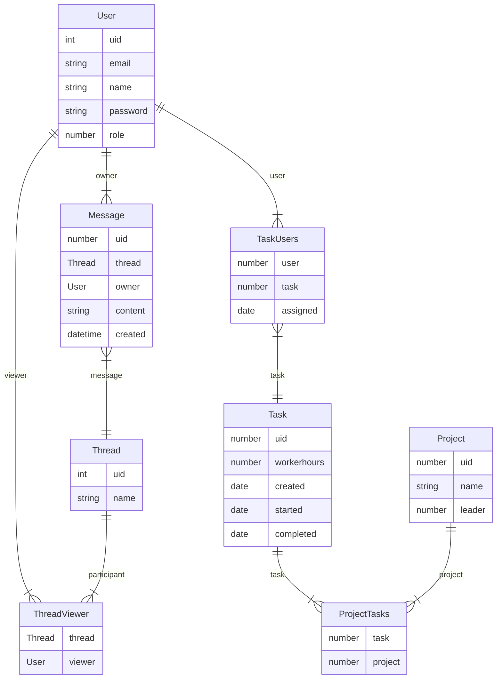

```mermaid
erDiagram

	Message }|--|| Thread : message

	User ||--|{ Message : owner
	User ||--|{ ThreadViewer : viewer
	Thread ||--|{ ThreadViewer : participant

	User ||--|{ TaskUsers : user
	TaskUsers }|--|| Task : task
	Task ||--|{ ProjectTasks : task
	Project ||--|{ ProjectTasks : project

	User {
		int uid
		string email
		string name
		string password
		number role
	}

	Thread {
		int uid
		string name
	}

	Message {
		number uid
		Thread thread
		User owner
		string content
		datetime created
	}

	ThreadViewer {
		Thread thread
		User viewer
	}

	Project {
		number uid
		string name
		number leader
	}

	Task {
		number uid
		number workerhours
		date created
		date started
		date completed
	}

	ProjectTasks {
		number task
		number project
	}

	TaskUsers {
		number user
		number task
		date assigned
	}

```
