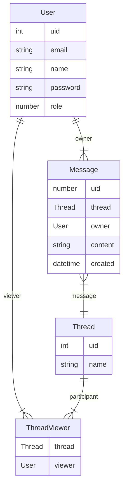

```mermaid
erDiagram

	Message }|--|| Thread : message

	User ||--|{ Message : owner
	User ||--|{ ThreadViewer : viewer
	Thread ||--|{ ThreadViewer : participant

	User {
		int uid
		string email
		string name
		string password
		number role
	}

	Thread {
		int uid
		string name
	}

	Message {
		number uid
		Thread thread
		User owner
		string content
		datetime created
	}

	ThreadViewer {
		Thread thread
		User viewer
	}

```
